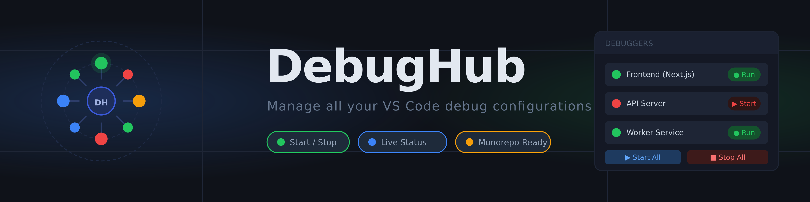
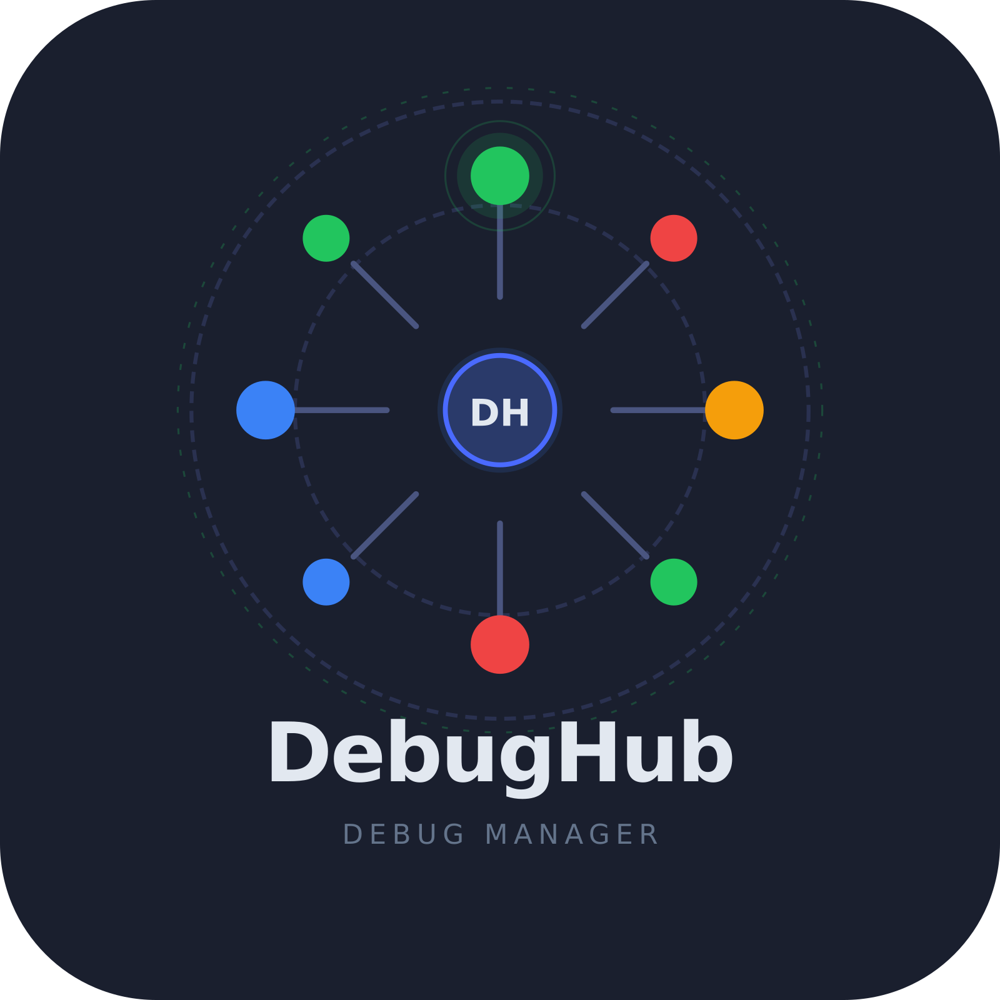

#  DebugHub

Manage all your VS Code debug configurations in one place. DebugHub simplifies debugging in monorepos and multi-service environments by providing a unified interface to view, manage, and control all your debuggers at once.

## 🎯 The Problem

Working with monorepos and multi-service applications in VS Code can be frustrating:

- VS Code's default debugger is slow to initialize
- Starting multiple debuggers requires launching them individually
- Managing multiple debug sessions becomes cumbersome
- No quick way to see the status of all active debuggers at a glance

## ✨ The Solution

DebugHub solves these challenges by providing a simple, unified interface to manage all your debug configurations:

- **See all debuggers in one list** — Every launch configuration from your workspace in a single quick-pick menu
- **Status indicators** — Know at a glance which debuggers are running (`🟢`) and which are stopped (`🔴`)
- **Quick actions** — Start or stop individual debuggers with buttons, no waiting
- **Batch operations** — Start or stop all debuggers with a single click
- **Multi-select** — Select multiple configurations and manage them together
- **Workspace-aware** — Works with single and multi-root workspaces

---

## 📦 Installation

### From VS Code Marketplace

1. Open VS Code
2. Go to **Extensions** (Ctrl+Shift+X / Cmd+Shift+X)
3. Search for **DebugHub**
4. Click **Install**

### From Source

1. Clone the repository:

   ```bash
   git clone https://github.com/JCassio1/DebugHub.git
   cd debughub
   ```

2. Install dependencies:

   ```bash
   npm install
   ```

3. Package the extension:

   ```bash
   npm run package
   ```

4. Install the `.vsix` file in VS Code:
   - Go to **Extensions** → **Views and More Actions** (⋯) → **Install from VSIX...**
   - Select the generated `debughub-*.vsix` file

---

## 🚀 Quick Start

### Open DebugHub

1. Click the **DebugHub status indicator** in the bottom right status bar (shows `● N` where N is the number of active debuggers)
2. Or use the command palette: **DebugHub: Open Popover** (Cmd+Shift+P / Ctrl+Shift+P)

### Manage Debuggers

**View configurations:**

- All launch configurations from `.vscode/launch.json` are listed
- Status indicator shows if each is running (`🟢`) or stopped (`🔴`)

**Start a debugger:**

- Click the **play icon** (▶) next to any configuration
- Or select configurations and click **Start All**

**Stop a debugger:**

- Click the **stop icon** (■) next to any running configuration
- Or click **Stop All** to stop everything

**Batch operations:**

- Select multiple configurations using checkboxes
- Press **OK** to toggle all selected (start if stopped, stop if running)

---

## 🎮 Features

### Status Bar Integration

- Real-time count of active debug sessions
- Click to open DebugHub popover instantly
- Color-coded indicator (green = active, gray = none)

### Quick Configuration Browser

- All workspace launch configurations in one view
- Grouped by workspace folder (in multi-root setups)
- Description shows configuration type and request mode

### Inline Actions

- **Play button**: Start individual debugger
- **Stop button**: Stop individual debugger
- **Checkboxes**: Multi-select for batch operations

### Top-level Controls

- **Start All**: Launch all configured debuggers
- **Stop All**: Terminate all active debug sessions

### Smart Selection Persistence

- Remembers which configurations you selected
- Automatically prunes invalid selections when configs change

---

## 📋 Commands

All commands can be invoked via the Command Palette (Cmd+Shift+P / Ctrl+Shift+P):

| Command                                     | Description                       |
| ------------------------------------------- | --------------------------------- |
| `debughub.openPopover`                      | Open the DebugHub quick-pick menu |
| `debughub.startAllDebugConfigurations`      | Start all launch configurations   |
| `debughub.startSelectedDebugConfigurations` | Start all selected configurations |
| `debughub.stopAllDebugSessions`             | Stop all active debug sessions    |
| `debughub.startDebugConfiguration`          | Start a specific configuration    |
| `debughub.stopDebugSession`                 | Stop a specific debug session     |
| `debughub.refreshSidebar`                   | Refresh the status bar indicator  |

---

## ⚙️ Configuration

DebugHub reads all launch configurations from:

- `.vscode/launch.json` in each workspace folder
- Workspace settings for multi-root setups

### Supported Debug Types

DebugHub works with any VS Code debugger type:

- `node` / `pwa-node` — Node.js
- `pwa-chrome` — Chrome/Chromium
- `debugpy` — Python
- `go` — Go
- `cppdbg` — C/C++
- And many more...

### Example `.vscode/launch.json`

```json
{
  "version": "0.2.0",
  "configurations": [
    {
      "name": "Backend API",
      "type": "pwa-node",
      "request": "launch",
      "program": "${workspaceFolder}/server/app.js",
      "console": "integratedTerminal"
    },
    {
      "name": "Frontend Dev",
      "type": "pwa-chrome",
      "request": "launch",
      "url": "http://localhost:3000",
      "webRoot": "${workspaceFolder}/client"
    }
  ]
}
```

---

## 🛠️ Development

### Requirements

- Node.js 18+
- npm 9+
- VS Code 1.85+

### Build

```bash
npm install
npm run compile
```

### Watch Mode

```bash
npm run watch
```

### Test

```bash
npm test
```

### Package

```bash
npm run package
```

---

## 🤝 Contributing

Contributions are welcome! Here's how to get started:

1. Fork the repository
2. Create a feature branch: `git checkout -b feature/your-feature`
3. Make your changes
4. Run tests: `npm test`
5. Commit: `git commit -am 'Add feature'`
6. Push: `git push origin feature/your-feature`
7. Open a pull request

See [CHANGELOG.md](./CHANGELOG.md) for version history.

---

## 📄 License

This extension is licensed under the MIT License. See [license.txt](./license.txt) for details.

---

## 🎓 Tips & Tricks

- **Keyboard navigation**: Use arrow keys to navigate configurations, Space to select, Enter to confirm
- **Filtering**: Type to search configuration names in the quick-pick menu
- **Multi-root workspaces**: Configurations are grouped by folder; your selection applies to all
- **Python debugging**: If using `debugpy`, ensure your script calls `debugpy.listen()` before DebugHub attempts to attach

---

## ❓ FAQ

**Q: Why doesn't my configuration show up?**  
A: Ensure the configuration is defined in `.vscode/launch.json` and has at least a `name` property.

**Q: Can I exclude certain configurations?**  
A: Not yet, but you can filter in the UI by typing. Consider removing unused configs from `launch.json`.

**Q: Does DebugHub support remote debugging?**  
A: Yes! Any debugger type that VS Code supports (including remote attach configurations) will work.

---

Made with ❤️ for developers who debug monorepos
